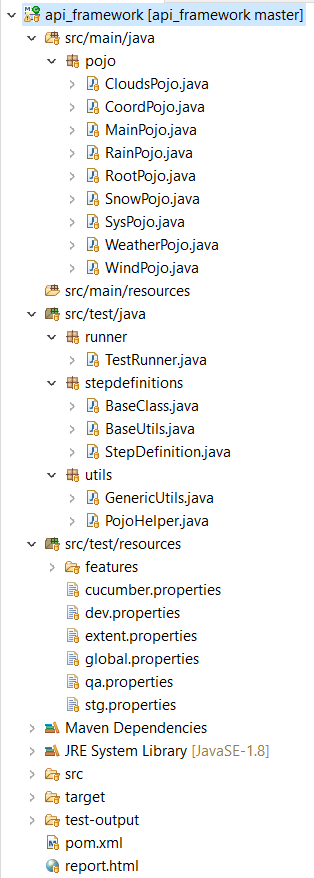
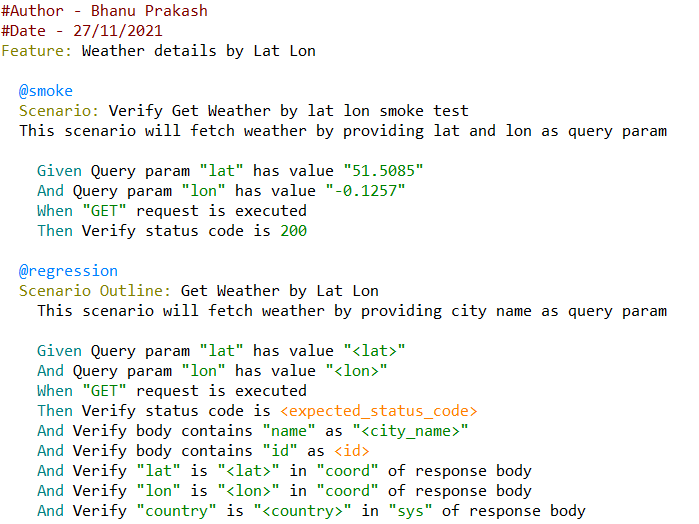
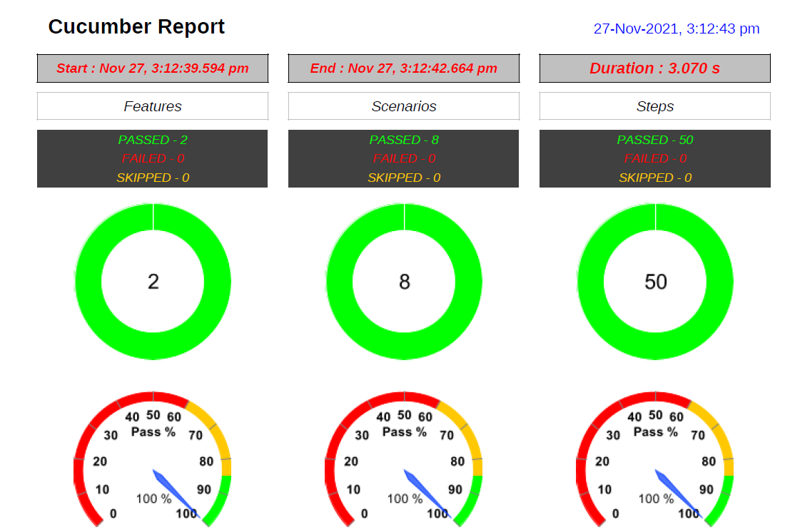
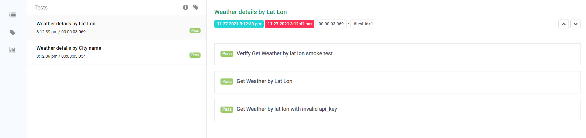
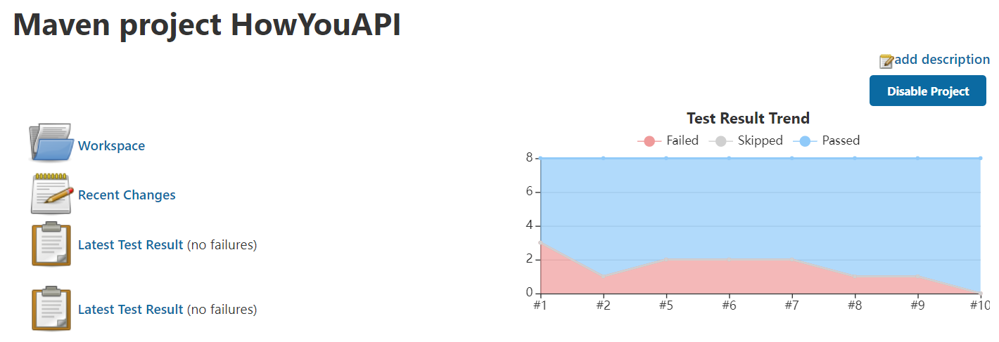

# API Framework 

The approach to framework:
### The approach to framework:
- The framework is designed with BDD approach which utilzes Feature files to define scenarios
- The scenarios are defined using Gherkin language with the Given, When, Then, And keyworkds
- The data required for scenarios are injected with the help of Examples
- RestAssured library is used for executing the API requests
- Schema for response is defined using POJO classes
- Validations are done with deserialization and Hamcrest matchers
- The reporting is achieved using Extent Reports with additional PDF generation capability and configurable path 
- Required dependencies are managed with help of Maven
- Parallel execution for feature files is achieved with sure-fire plugin for Maven
- For continuous integration Jenkins is configured

### The Endpoints considered for this POC:
- api.openweathermap.org/data/2.5/weather?q={city name}&appid={API key}
- api.openweathermap.org/data/2.5/weather?lat={lat}&lon={lon}&appid={API key}

### Approach to deriving scenarios with the endpoint:
- In general scenarios can be derived based on the following approach
  - Query param variations
  - Path param variations
  - Header value variations
  - Body input variations
- In this specifc case, the positive and negative scenarios were derived by varying the query params with valid and invalid api keys 

### CI/CD Integration with Jenkins:
- Requirements:
  - Jenkins installed
  - Maven plugin
  - Git
  - JDK

### Issues discovered:
- The values for weather like temperature, humidity, sunrise etc keep changing in real environment.  
- The JSON response keys can vary based on the season, for example, snow, rain etc.

Documentation:
### Screenshots:
-----------------------------------------------------------------------------------------------------------------------------------
- Framework Folder structure
- 
-----------------------------------------------------------------------------------------------------------------------------------
- Framework Feature File
- 

-----------------------------------------------------------------------------------------------------------------------------------
- Framework PDF Report
- 

-----------------------------------------------------------------------------------------------------------------------------------
- Framework HTML Report
- 

-----------------------------------------------------------------------------------------------------------------------------------
- Jenkins CI Execution Report
- 

-----------------------------------------------------------------------------------------------------------------------------------
